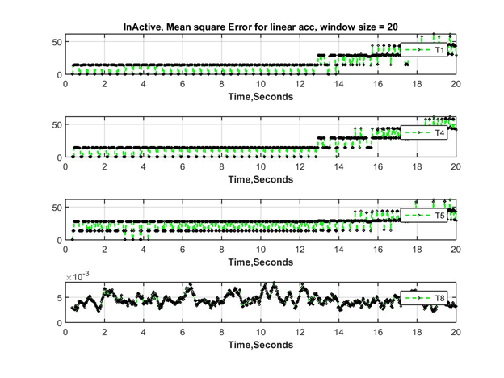

# Does your lunar lander have thruster issues? Find them out [onboard or on ground].
Find out which thrusters have been acting faulty on your lunar lander using your IMU data. Assuming digital control for pulse-controlled thrusters. 

<p align="center">

</p>
<p align="center">
    <em>Fig: Thruster FDIR for lunar lander: simulation </em>
</p>

# Theoretical framework
Documented theory [here](https://github.com/visheshv/fdir-lunar-lander-thrusters/blob/main/ThrusterFDIR.pdf). Works well for modern robotic lunar landers.

# MICE functions
Download and extract the MICE functions into the repository from [here](https://drive.google.com/file/d/13-JjxwSo1KwZxaKAvRTxtmL6ILYzBJmz/view?usp=sharing)

# Instructions
Setup the repository and run main.m

# File tree 

```
Main
│   Block1.mat
│   C2_tank.mat
│   debug_ThrusterFDIR.m
│   FuelTankParameters.mat
│   FunPosVel.m
│   GetCorrections.m
│   main.m
│   main.m~
│   octave-workspace
│   orb2eci.m
│   OrbitElements.mat
│   PositionCanting.mat
│   PWPFParameters.mat
│   RK4.m
│   ThrusterParameters.mat
│   Thruster_FDIR.m
│
├───DisturbanceTorqueModel
│       dist_torque.m
│
├───FDIR
│       generate_faultmode_accelerations.m
│       generate_nominal_accelerations.m
│       LinearAccGraph.m
│       Sensor_IMU_V2.m
│       Sigma_Q_Error.m
│       store_in_window.m
│       store_in_window_dist.m
│
├───FunctionsKinematicDynamics
│       eul2q.m
│       q2eul.m
│       qmult.m
│       qnorm.m
│       q_dynamics.m
│
├───GyroModels
│       accelerometer.m
│       GyroLandis.m
│       gyro_lpf.m
│       LKF.m
│       propagation.m
├───OtherFunctions
│   │   C2.mat
│   │   Cartesian2Keplerian.m
│   │   Compute_liquid_level_integrals.m
│   │   Compute_MoI.m
│   │   Compute_MoI_terms.m
│   │   degtorad.m
│   │   fill_angle_data.mat
│   │   FK5.m
│   │   FunPosVel.m
│   │   gdate.m
│   │   GetSunPointingAttitude.m
│   │   HPF.m
│   │   JD2GAST.m
│   │   JD2GMST.m
│   │   jd2jdate.m
│   │   jd2str.m
│   │   JD2UTC.m
│   │   LPF.m
│   │   NonSphericalGravityV1.m
│   │   PointMassGravityEarth.m
│   │   PointMassGravityMoon.m
│   │   qGetQModified.m
│   │   r2r.m
│   │   rkf78.m
│   │   rkf78WithEventsStrct.m
│   │   rkf78WithStruct.m
│   │   rot.m
│   │   shadowfunction.m
│   │
│   └───Timings,Nutation,GravityModel
│           atan3.m
│           EGM2008.mat
│           EGM96.mat
│           eopc04.mat
│           findleap.m
│           GetCorrections.m
│           NutationData.mat
│           readleap.m
│           ReadMe.txt
│           rkf78.m
│           taiutc.mat
│           utc2tdb.m
│
└───Sensor_model
        Data_Points
        Generate_Accelerometer_Measurements.m    
```


